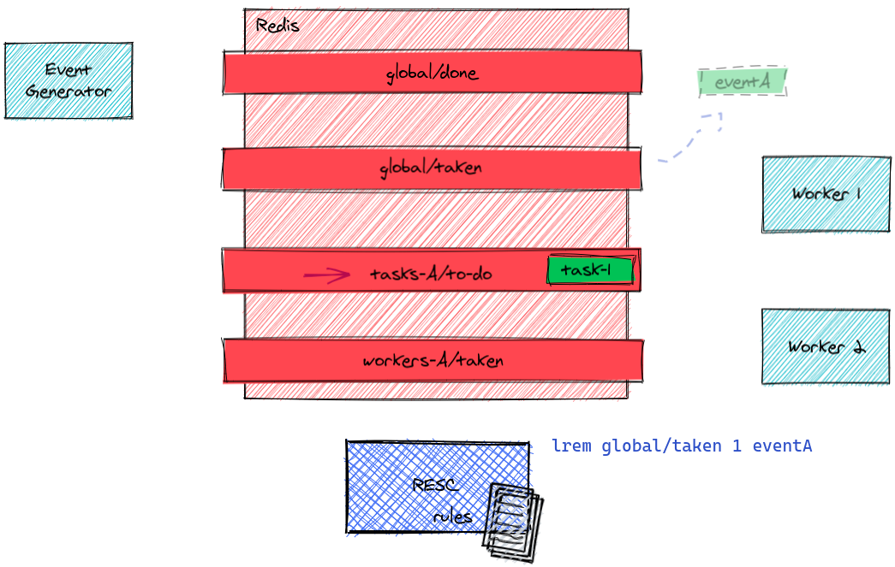

# Purpose

Redis lists are wonderful as task queues for distributed workers. A worker can safely and atomically take a task, even when several ones watch the same queue.

**Resc** is a reliable and configurable task generator for redis.

It watches one or several queues for events, which can be task completion notifications or simple "root" events, and applies rules to generate tasks.

It achieves this in a safe and monitorable way and takes care, for example, of avoiding duplicating tasks.

Resc is written in rust for safety and performance.

# How it generally works

## Queues setup

Queues are defined by the resc configuration file. Here's we'll have a very simple setup.

We won't show how tasks are deduplicated, logged, or published for supervision.

### Some Event Generator pushes an event to the "global/done" input queue

Instead of just a "global" queue, there could be several input queues but one is often enough even with hundreds of event sources.

### Resc takes the event

`brpoplpush` is an atomic operation, the event is guaranteed to not be lost: it's either in global/done or in global/taken.

### Resc applies its rules to generate zero or more tasks

### Resc removes the event from global/taken

It was kept here so that the rules could be played again on restore in case of crash during rules computation (some rules may imply calling a server).

### A worker takes the task

Once again, `brpoplpush` is an atomic operation, the worker may die during effort, knowing the task won't be lost

### When the job is done, the worker notifies it with an event

### ... then removes the task from its taken queue

## ... and it goes on

Resc will now apply its rules to the `done-1` event, which may lead to new tasks, or maybe there's nothing more to do.

Of course everything can happen with thousands of events, tasks and even workers.

# Workers

Resc, as a scheduler, assumes workers handle tasks in this very simple way:

1. pick a task in a queue and atomically move it to a "taken" list : `BRPOPLPUSH myqueue/todo myqueue/taken 0`

2. do the task

3. clean the "taken" list : `LREM myqueue/taken the-task`

4. notify the scheduler the task is done by pushing it to a "done" queue: `LPUSH global/done the-task`

This scheme ensures several workers can safely work on the same queue.

You often want the queues to be free of duplicates.
You may still want to queue tasks while they are being processed (for example you may want a recomputation because some new info arrived).

If you want deduplicating of a task queue, you declare a task set in the configuration and the worker, just after having picked the task from the queue and before executing it, remove it from the set too.

Java, Go, Rust and node.js implementations of workers are provided in the examples directory.
They all show how to use (or not) the deduplicating queue.

# Introductory Example

The complete instructions on executing this example, and a business logic explanation, are available at [examples/simple-example.md](examples/simple-example.md).

## Simple regex based task generation

Here's a simple configuration file:

	{
		"redis": {
			"url": "redis://127.0.0.1/"
		},
		"watchers": [
			{
				"input_queue": "global/done",
				"taken_queue": "global/taken",
				"rules": [
					{
						"name": "TRT computation on data acquisition",
						"on": "^acq/(?P<process_id>\\d+)/(?P<product_id>\\d+)$",
						"todo": {
							"task": "trt/${process_id}/${product_id}",
							"queue": "trt/${process_id}/todo-queue",
							"set": "trt/${process_id}/todo-set"
						}
					}
				]
			}
		]
	}

Resc can be launched with this configuration using

	resc myconf.json

or (during development)

	cargo run -- myconf.json

Resc starts a watcher, a thread, over the specified `input_queue`.

When a new event (a string in the `global/done` list) appears, it's atomically moved (using [BRPOPLPUSH](https://redis.io/commands/brpoplpush)) to the `global/taken` list and watcher's rules are executed.

Assuming the coming task is `"acq/123/456"`, then the first (and unique) rule of our example will match, according to the regular expression in `"on""`.

Several variables are dynamically generated and valued:

	process_id = 123
	product_id = 456

Those variables are used to extrapolate the task and queue of the todo part of the rule.

The task `"trt/123/456"` would then be created.

If the `"trt/123/todo-set"` set doesn't contain the task already, then it's added to that set (with the time which may be used for monitoring) then to the `"trt/123/todo-queue"` queue.

After having executed all rules on this task, it's cleared from the `"global/taken"` queue and the watcher goes on watching the `"global/done"` queue again for other tasks.

### Logging

You don't usually want a lot of log, that's why the default log includes only warnings, but during the setup of your system you might want to see what events comes in your queues and what tasks are generated.

You can see more by setting the log level to `INFO`:

	RUST_LOG="info" resc myconf.json

or if you want to see what rules were activated:

	RUST_LOG="debug" resc myconf.json

## Fetching some data to compute new tasks

Sometimes it might be necessary to query a web service to compute the tasks to generate in response to an event.

Let's say there is a REST service returning the elements which would be logically impacted when some other one change (for example a change in a customer command might involve the recomputing of some product validity for that command).

If there's certain event on product 5ab7342600000040, you want to query

     http://my-web-service/products/5ab7342600000040/direct-children

which responds in JSON with the list of products which should be recomputed:

	[
		{"processId":634876914,"productId":"5ab7e7dc00000040"},
		{"processId":634876914,"productId":"5ab7ebe800000040"}
	]

and for each of those products you want to generate a new task.

Then the relevant rule could be like this:

	{
		"name": "TRT propagation to children",
		"on": "^trt/(?P<process_id>\\d+)/(?P<product_id>\\w{16})$",
		"fetch": [{
			"url": "http://my-web-service/products/${product_id}/direct-children",
			"returns": "child"
		}],
		"todo": {
			"task": "trt/${child.processId}/${child.productId}",
			"queue": "trt/${child.processId}/todo-queue",
			"set": "trt/${child.processId}/todo-set",
		}
	}

The `fetch` element describes the HTTP query and the namespace of the variables read in the web-service's response and used for generation of tasks, queues and sets.

In our example, we'd end with two new tasks, `"trt/634876914/5ab7e7dc00000040"` (added to queue `"trt/634876914/todo-queue"`), and `"trt/634876914/5ab7ebe800000040"` (added to queue `"trt/634876914/todo-queue"`).

## Switching queues, default configuration values

When you have several rules and one of them involves querying a remote service as in our example, you don't want all the rules to suffer from a possible slow-down of this remote service.

That's when you may want to have another watcher, and thread, handling those specific task generations.

In order to do that, you want a rule just passing the task to another queue which another watcher watches.

Let's call this new queue `global/to-propagate` (you give your queues the names you want).

The new configuration becomes

	{
		"redis": {
			"url": "redis://127.0.0.1/"
		},
		"watchers": [
			{
				"input_queue": "global/done",
				"taken_queue": "global/taken",
				"rules": [
					{
						"name": "TRT computation on data acquisition",
						"on": "^acq/(?P<process_id>\\d+)/(?P<product_id>\\d+)$",
						"make": {
							"task": "trt/${process_id}/${product_id}",
							"queue": "trt/${process_id}/todo-queue",
							"set": "trt/${process_id}/todo-set"
						}
					},
					{
						"name": "TRT propagation to children : switch queue",
						"on": "^trt/(?P<process_id>\\d+)/(?P<product_id>\\w{16})$",
						"make": {
							"queue": "global/to-propagate"
						}
					}
				]
			},
			{
				"input_queue": "global/to-propagate",
				"rules": [
					{
						"name": "TRT propagation to children : make child tasks",
						"on": "^trt/(?P<process_id>\\d+)/(?P<product_id>\\w{16})$",
						"fetch": [{
							"url": "http://my-web-service/products/${product_id}/direct-children",
							"returns": "child"
						}],
						"make": {
							"task": "trt/${child.processId}/${child.productId}",
							"queue": "trt/${child.processId}/todo-queue",
							"set": "trt/${child.processId}/todo-set"
						}
					}
				]
			}
		]
	}

This way no remote service can slow down the global queue managment.

You may have noticed the configuration is a little lighter than what could have been expected. It's because some settings are optional.

When omitted, `taken_queue` is simply `input_queue` with `/taken` added. So here the second watcher would use as temporary queue `global/to-propagate/taken`.

When `make/task` is omitted, the generated task is the same string as the input task. More precisely, the default value of `make/task` is `"${input_task}"`, `${input_task}` being a variable you can use in your task/queue/set generation.

# Development Status

Resc is developped by [Fives KEODS](https://www.fivesgroup.com/).

This is a preliminary version, without any kind of guarantee and not yet considered industrial grade.

# License

MIT
