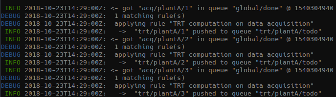
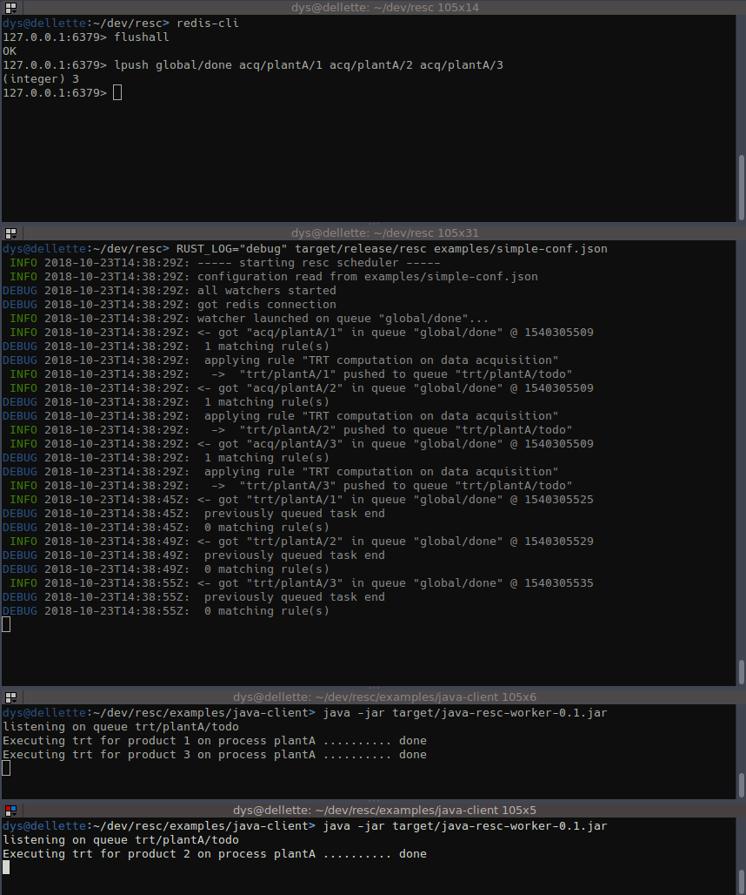

## Introduction

This simple example shows

* the resc scheduler generating tasks according to one of the simplest possible rule
* one or several java worker(s) picking up tasks, executing them, and signaling end of execution
* one or several node.js worker(s) picking up tasks, executing them, and signaling end of execution
* one or several rust worker(s) picking up tasks, executing them, and signaling end of execution

The node and java workers have exactly the same behavior;

The business logic here is that a source sends events informing us that some data has been received regarding a plant "plantA" and several products (the nature of this event is `"acq"`) and that we must execute some treatments.

So we'll manually generate events like `"acq/plantA/123"` and observe the scheduler generate tasks like `"trt/plantA/123"`, and then the worker(s) handle those tasks.

## Compilation, preparation

Of course Redis must be installed and started.

### Compilation of the scheduler

In the root directory of the resc project, execute

	cargo build --release

This builds the `target/release/resc` executable.

### Compilation of the java worker

You need to have a Java9 JDK and Maven installed.

Move to the `examples/java-client` directory, then run

	mvn package

This builds the `target/java-resc-worker-01.jar` jar file.

### Preparation of the node.js worker

You need to have node and yarn installed

Move to the `examples/node-client` directory, then run

	yarn

### Compilation of the Go worker

You need to have a go dev environment set up.

Start by fetching the official Go Redis driver:

	go get github.com/garyburd/redigo/redis

Then compile the application:

	cd examples/go-client
	go build

### Preparation of the rust worker

As this is only a demonstration, we don't need to compile as release. We do nothing here.

## Running the Simple Example

All this can be done in whatever order. In order to see what happens you should have one console per program.

### Starting the redis cli

Just do

	redis-cli

At the prompt, if you previously tried a few examples, you might want to do

	flushall

which removes everything.

### Starting the scheduler

With the normal log setting, only errors and warning are displayed.
If you want to see something, you should set the log level to "debug" or at least "info". In the root directory, do

	RUST_LOG="debug" target/release examples/simple-conf.json

### Starting workers

Launch as many workers as desired.

Whatever the worker you launch, you should see

	listening on queue trt/plantA/todo

#### Start a Java worker

	java -jar examples/java-client/target/java-resc-worker-0.1.jar

#### Start a node worker

	node examples/node-client/main.js

#### Start a go worker

	examples/go-client/go-client

#### Start a rust worker

	cd examples/rust-client
	cargo run

### Generating a few root events

In the redis cli do

	lpush global/done acq/plantA/1 acq/plantA/2 acq/plantA/3

You should then see the scheduler immediately generating the 3 resulting tasks:

The workers pick tasks execute them, and then send back the tasks as done in `global/done`.

Here's what your screen should look like:

